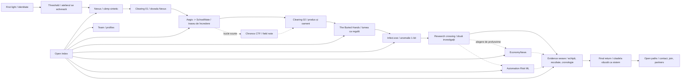

# Architecture thesis 03: The Braided Expedition

Status: arhitectură macro aleasă după testul control-loop; gate de aprobare înaintea
blockout-ului lumii continue.

Acest pas răspunde corecției primite după prototip:

> Experiența are potențial, dar nu trebuie să fie un hub cu patru lumi și nici să aibă
> exclusiv senzația unui joc. Trebuie să rămână recognoscibilă și ca website.

## Decizia într-o propoziție

**Transylvanian Bears va fi o expediție continuă printr-un singur sistem spațial care
se transformă din proiect în proiect, întreruptă intenționat de suprafețe editoriale
native web; un Index permanent oferă în paralel acces direct la fiecare proiect,
membru, rezultat și sursă.**

Nu construim patru portaluri, patru biome-uri ori patru niveluri. Nu construim nici un
film lung controlat exclusiv prin scroll. Construim două moduri coerente de a parcurge
aceeași informație:

1. **Guided Expedition** pentru descoperire, atmosferă și participare;
2. **Open Index** pentru citire, verificare, comparație și acces rapid.

Ambele sunt produsul principal. Indexul nu este fallback, iar expediția nu este un
intro obligatoriu înaintea conținutului.

## Ce a schimbat testul

Control-loop-ul a validat patru lucruri:

- traiectoria regizată este mai potrivită decât locomotion liber;
- free-look-ul local produce prezență fără a cere control FPS;
- Lens-ul poate transforma o afirmație într-o acțiune verificabilă;
- revenirea într-un spațiu schimbat este un payoff lizibil.

Testul a invalidat însă repetarea aceleiași bucle la scară de site. Dacă fiecare caz
începe dintr-un hub și se termină în același hub, vizitatorul învață structura de
meniu, nu evoluția echipei. Patru destinații radiale ar reduce șapte proiecte, o echipă,
premii, cercetare și istorie la patru butoane tematice.

Prin urmare:

- atelierul este un **prag de orientare**, nu centrul permanent al navigării;
- Lens-ul este un **instrument editorial-spațial**, nu inventar de joc;
- proiectele sunt **capitole care se cauzează vizual**, nu lumi independente;
- singura revenire amplă la locul inițial are loc aproape de final, când schimbarea
  acumulată poate fi înțeleasă dintr-un singur cadru.

## Research aplicat

### Forma spațiului trebuie să fie forma poveștii

În prezentarea GDC despre `Tacoma`, Fullbright formulează relația directă dintre
environmental storytelling și geometria nivelului: dacă povestea se descoperă în
mediu, forma spațiului descrie forma poveștii. Lecția utilă nu este să copiem
non-linearitatea unui joc, ci să evităm un plan radial când povestea noastră este una
de acumulare și transfer între discipline.

Sursă: [GDC Vault, Designing for Non-Linear Story Discovery in Tacoma](https://www.gdcvault.com/play/1025178/Level-Design-Workshop-Designing-for)

### O coloană vertebrală narativă supraviețuiește schimbării de tool-uri

`The Spark` a fost construit mai întâi ca succesiune de beat-uri, apoi ca runtime.
Mediul, personajele și interfața spun aceeași poveste, iar UI-ul își schimbă caracterul
odată cu lumea. Tehnic, scenele folosesc porțiuni distincte dintr-un controller comun,
iar o singură scenă grea este activă la un moment dat.

Adoptăm coloana vertebrală, sincronizarea dintre lume și DOM și încărcarea pe vecinătăți.
Nu adoptăm forma de scurtmetraj pur: proiectele noastre cer citire, credite și surse.

Sursă: [Codrops, The Spark](https://tympanus.net/codrops/2026/01/09/the-spark-engineering-an-immersive-story-first-web-experience/)

### 3D-ul trebuie să sprijine lectura, nu să o înlocuiască

Articolele interactive realizate pentru The Atlantic folosesc medii WebGL pentru a
modela narațiunea, dar păstrează scrolling-ul familiar și ritmul cititorului. Acesta
este precedentul relevant pentru camerele noastre editoriale: scena poate rămâne vie
în spate, în timp ce documentul devine temporar suprafața principală.

Sursă: [The Atlantic / Perficient, Immersive Reading Experience](https://www.perficient.com/success-stories/atlantic)

### Continuitatea nu cere dispariția paginilor

`Bisous` combină o grilă editorială stabilă, proiecte lizibile și o tranziție continuă
spre următoarea lucrare. Tutorialul Codrops despre tranziții persistente WebGPU arată
și modelul tehnic: DOM-ul rămâne documentul și sursa geometriei, iar un singur canvas
poate lega vizual rutele fără ca paginile să pară că se rup.

Surse:

- [Codrops, Inside Bisous](https://tympanus.net/codrops/2026/06/29/inside-bisous-designing-an-editorial-experience-for-cinematic-cgi/)
- [Codrops, Persistent Page Transitions with WebGPU](https://tympanus.net/codrops/2026/06/30/building-persistent-page-transitions-with-webgpu-and-vanilla-javascript/)

### Două căi către același conținut sunt o cerință, nu un compromis

W3C recomandă mai multe moduri de a ajunge la aceeași pagină și notează explicit că
unii utilizatori preferă explorarea secvențială, iar alții o hartă, un index sau o
căutare. Guided Expedition și Open Index rezolvă aceeași nevoie de produs și păstrează
orientarea pentru tastatură, reduced motion și vizite scurte.

Sursă: [W3C, Understanding Multiple Ways](https://www.w3.org/WAI/WCAG22/Understanding/multiple-ways.html)

## Topologii comparate

| Topologie | Imersiune | Agency utilă | Dovadă rapidă | Continuitate | Website feel | Verdict |
| --- | --- | --- | --- | --- | --- | --- |
| Hub permanent + patru aripi | mare la început | medie | medie | slabă, reveniri repetitive | slab | respinsă |
| Open world / hartă liberă | foarte mare | foarte mare, dar difuză | slabă | mare | foarte slab | respinsă |
| Film liniar controlat prin scroll | mare | mică | medie | foarte mare | mediu | insuficient singur |
| Pagini de proiect separate cu tranziții | medie | bună | foarte bună | medie | foarte bun | insuficient singur |
| **Expediție împletită + Index** | **foarte mare** | **mare în noduri** | **foarte bună** | **foarte mare** | **foarte bun** | **aleasă** |

## Topologia aleasă

`Braided Expedition` are patru elemente, dar nu patru lumi:

1. **Spine:** traseul regizat care păstrează direcția și ritmul.
2. **Knots:** momente scurte de agency în care Lens-ul, selecția sau comparația schimbă
   ceea ce urmează.
3. **Clearings:** opriri editoriale în care camera se stabilizează, DOM-ul devine
   principal și informația poate fi citită normal.
4. **Loops:** aprofundări opționale care se întorc la punctul curent, nu la un hub.



Diagrama descrie cauzalitate, nu un sitemap circular. Vizitatorul nu se întoarce după
Nexus ca să aleagă Aegis. Bounding boxes din Nexus devin planul de acces Aegis;
traseul verificat se pliază în regula spațială din Buried Hands; imaginea 1-bit devine
eșantion de date; axele de cercetare devin cronologia dovezilor.

## Taxonomie versus traseu

Indexul grupează proiectele prin filtre care se pot suprapune. Taxonomia descrie ce
este proiectul; traseul descrie ordinea în care este descoperit. Nu transformăm cele
patru filtre în patru porți sau patru lumi.

| Filtru | Proiecte | Observație |
| --- | --- | --- |
| Video Games | The Buried Hands, Infect.exe | două jocuri și două studii de caz distincte |
| School Software | Aegis, SchoolMate | produse separate, legate editorial |
| Machine Learning | Project Nexus, EconomyNews, Automation Risk | Nexus este applied ML; celelalte două sunt și cercetare |
| Research Papers | EconomyNews, Automation Risk | ambele produc lucrare și folosesc ML |

Project Nexus nu apare la `Research Papers`. EconomyNews și Automation Risk apar în
ambele filtre relevante, fără a fi duplicate în date sau prezentate drept patru
proiecte diferite.

## Harta capitolelor

### 00. First Light: website înainte de spectacol

- Numele `Transylvanian Bears`, categoria echipei și navigația sunt vizibile imediat.
- Nu există `Press Start`, loader obligatoriu sau logo fără explicație.
- Două comenzi au aceeași greutate: `Follow the signal` și `Open index`.
- Lumea poate începe să respire în spate, dar conținutul esențial există în HTML.

### 01. Threshold: atelierul ca act, nu ca meniu

- Vizitatorul trece o singură dată prin atelier.
- Cele șase contribuții construiesc Lens-ul și traseul, fără avataruri sau stații care
  funcționează ca butoane către biome-uri.
- Selectarea unui membru poate deschide profilul, dar progresul nu depinde de asta.
- La ieșire, atelierul se desface și devine drumul. Nu mai rămâne în urmă ca lobby.

### 02. Synthetic Field: Project Nexus

- Prima interacțiune extinde bucla validată: raw -> segmentation -> detection ->
  verificare umană.
- Spațiul nu este o cameră decorată cu AI; este chiar problema datasetului exprimată
  prin perspectivă, variație și straturi observabile.
- După interacțiune, camera se oprește într-un clearing cu capturi reale, metodă,
  metrici, autori, limitări și sursa publică.

### 03. Trust Passage: Aegis și SchoolMate

- Detecțiile Nexus se aplatizează în noduri, roluri și trasee de acces.
- Vizitatorul urmărește un eveniment prin sistem; nu joacă un mini-joc generic de
  hacking.
- Clearing-ul explică evoluția Aegis -> SchoolMate, interfața reală, rolurile și
  rezultatul Skills for the Future.
- Chronos CTF poate fi o buclă scurtă de field note despre gândirea adversarială, nu o
  a cincea lume inventată fără proiect public.

### 04. Rule Descent: The Buried Hands și Infect.exe

- Planul de circulație devine regula labirintului, iar Lens-ul devine lumină limitată.
- Gameplay-ul autentic rămâne centrul dovezii; 3D-ul site-ului nu pretinde că este jocul
  real.
- Infect.exe întrerupe materialul în 1-bit pentru un beat scurt, distinct și intens.
- Cele două jocuri primesc rute și studii de caz proprii, nu sunt comprimate într-un
  singur card `Games`.

### 05. Research Crossing: două trasee care se revăd

- Pixelii devin observații, iar spațiul se deschide într-o intersecție de cercetare.
- EconomyNews și Automation Risk pot fi parcurse în orice ordine sau doar rezumate.
- Alegerea schimbă ordinea explicației, nu blochează conținutul celuilalt proiect.
- Graficele, metodologia, limitele și lucrările sunt DOM semantic, nu texturi în 3D.

### 06. Evidence Weave: oameni și rezultate în context

- Contribuțiile membrilor, proiectele, premiile și milestone-urile se întâlnesc într-o
  cronologie relațională.
- Premiile sunt atașate proiectelor și surselor; nu există cameră cu trofee.
- Internshipul Deutsche Bank rămâne milestone până la clarificarea participanților.
- Proiectele personale apar numai după confirmare; placeholder-ele rămân interne.

### 07. Final Return: o singură revenire, cu motiv

- Camera ajunge deasupra aceluiași prag din prolog, nu se teleportează într-un hub.
- Toate transformările anterioare sunt vizibile simultan în arhitectură.
- Payoff-ul este înțelegerea relațiilor, nu completarea unui progress bar.
- De aici se deschid direct Work, Team, Archive, Join și Contact.

## Continuitatea materială

Fiecare tranziție trebuie să conserve minimum un element și să îi schimbe funcția:

| Din | Element conservat | Devine | Motiv |
| --- | --- | --- | --- |
| relief | curbă topografică | circuitul atelierului | semnalul găsește echipa |
| atelier | diafragma Lens-ului | câmp vizual Nexus | contribuțiile devin observație |
| Nexus | bounding box | nod de acces Aegis | detecția devine decizie |
| Aegis | traseu validat | hartă de reguli | protecția devine world design |
| Buried Hands | lumină / pixel | grilă 1-bit Infect.exe | două forme de joc se ating |
| Infect.exe | bit | observație statistică | imaginea devine măsură |
| research | axă și interval | cronologie de dovezi | metoda capătă context istoric |
| archive | rețea de contribuții | planul citadelei | proiectele devin sistem comun |

Un fade poate masca o eroare sau un fallback, dar nu este tranziția creativă implicită.

## Contractul de website feel

### Chrome web persistent

Pe toate stările, inclusiv în 3D, există o navigație compactă și predictibilă:

- wordmark / Home;
- Work;
- Team;
- Archive;
- Index;
- Contact;
- motion și audio.

În cadrele cinematice, chrome-ul se poate comprima, dar nu dispare și nu își schimbă
ordinea. `Esc` nu este singura cale de ieșire.

### Clearings editoriale

Un clearing nu este modal, HUD sau text peste o imagine aglomerată. Este un pasaj
semantic cu:

- titlu, context și problemă;
- media reală, caption și credit;
- proces, decizii și limitări;
- metrici cu etichete și proveniență;
- membri și contribuții exacte;
- link la repo, build, lucrare, deck sau sursă;
- `Continue expedition` și `Open full case study`.

Scroll-ul este nativ în clearing. Camera rămâne stabilă ori răspunde lent, fără să
consume fiecare pixel de scroll într-o coregrafie. Cititorul își controlează ritmul.

### Rute reale și istoric real

Arhitectura de URL propusă:

```text
/
/journey
/work
/work/project-nexus
/work/aegis
/work/schoolmate
/work/the-buried-hands
/work/infect-exe
/work/economy-news
/work/automation-risk
/team
/team/:member
/archive
/field-notes/chronos-ctf
/join
/contact
```

- Orice studiu de caz se deschide direct, fără prolog.
- Back/forward restabilește pagina și punctul expediției.
- URL-ul se poate copia din orice clearing.
- Fără JavaScript sau WebGL, toate rutele, textele și linkurile rămân utilizabile.

### Raportul experiență / website

Ținta de ritm pentru prima vizită, nu un KPI rigid:

- Guided Expedition: aproximativ 55% spațiu, acțiune și tranziții; 45% lectură,
  comparație și dovadă;
- Direct case study: maximum 20% tranziție și atmosferă; minimum 80% conținut
  editorial;
- mobil și Reduced Motion: conținut editorial complet, cu 3D folosit ca fundal și
  tranziție, nu ca metodă exclusivă de acces.

## Contractul de agency

Bucla din `08-core-loop-control.md` se folosește numai în **knots**. Nu fiecare proiect
primește mini-joc din obligație.

Un knot intră în produs numai dacă:

1. acțiunea reprezintă o decizie reală din proiect;
2. două alegeri produc consecințe inteligibile diferite;
3. rezultatul poate fi explicat prin lume, nu doar prin mesaj;
4. interacțiunea durează sub 45-60 de secunde înaintea dovezii;
5. skip-ul duce la aceeași informație factuală;
6. tastatura, touch și reduced motion păstrează sensul.

Ținta inițială este trei knots puternice în întreaga expediție:

- Lens / Nexus;
- trace / Aegis;
- compare hypothesis / Research.

Buried Hands folosește gameplay autentic sau un fragment scrubbable, nu o copie slabă
a jocului în site. Infect.exe este o transformare scurtă de limbaj, nu un puzzle
obligatoriu.

## Ce elimină senzația de joc generic

Respingeri explicite:

- `Press Start`, health, XP, score, quest log sau `Mission complete`;
- WASD ca intrare implicită;
- inventar de obiecte și pickup-uri fictive;
- NPC care explică portofoliul;
- patru porți cu culori diferite;
- hartă mare care cere deplasare pentru a găsi un link;
- lore inventat peste proiecte reale;
- premii transformate în collectibles;
- interfață sci-fi generică peste tot;
- obligarea vizitatorului să termine expediția înainte să poată citi.

Termenii publici sunt `visitor`, `reader`, `project`, `source`, `index` și `continue`.
`Player`, `mission`, `level`, `inventory` și `unlock` rămân numai limbaj intern de
prototip când ajută echipa de producție.

## Modelul de încărcare al lumii

Continuitatea percepută nu înseamnă o singură scenă gigantică în memorie.

- Un singur canvas persistent păstrează camera, iluminarea globală și materialul de
  tranziție.
- Fiecare vecinătate conține scena curentă, legătura anterioară și legătura următoare.
- Zonele grele se încarcă înaintea pragului și se eliberează după ce forma conservată
  a trecut în următoarea scenă.
- Clearings pot folosi DOM, video, imagini și plane GPU fără a încărca geometrie 3D
  inutilă.
- Detecția capabilităților decide WebGL/WebGPU, rezoluție, post-processing, animații
  ambientale și fallback static.

Engine-ul final nu este decis în acest document. R3F/Three validează acum controlul;
WebGPU, Blender, Houdini, video generativ sau alte unelte intră numai după lookdev și
teste de producție specifice scenei.

## Mapping editorial complet

| Entitate | Moment în expediție | Suprafață web | Rută directă | Stare |
| --- | --- | --- | --- | --- |
| Project Nexus | Synthetic Field + knot Lens | case study tehnic | `/work/project-nexus` | dovadă bună |
| Aegis | Trust Passage + knot trace | case study produs | `/work/aegis` | dovezi bune, credite în validare |
| SchoolMate | clearing conectat după Aegis | case study produs | `/work/schoolmate` | relația cu Aegis trebuie clarificată |
| The Buried Hands | Rule Descent | gameplay, proces, postmortem | `/work/the-buried-hands` | build public |
| Infect.exe | interludiu 1-bit | mini case study separat | `/work/infect-exe` | rezultate verificate |
| EconomyNews | Research Crossing | lucrare, metodă, grafice | `/work/economy-news` | surse existente |
| Automation Risk ML | Research Crossing | repo, metodă, rezultate | `/work/automation-risk` | titlu/premiu de clarificat |
| Chronos CTF | buclă lângă Aegis | field note / writeup | `/field-notes/chronos-ctf` | dovadă publică lipsă |
| Premii | lângă proiect, apoi Evidence Weave | arhivă filtrabilă | `/archive` | mixt |
| Deutsche Bank | Evidence Weave | milestone, nu premiu | `/archive` | participanți de clarificat |
| Echipă | urme de-a lungul traseului + weave | profiluri individuale | `/team/:member` | bio-uri de validat |
| Proiecte personale | numai în profiluri | sloturi ascunse până la confirmare | `/team/:member` | placeholders interne |

## Gate pentru blockout-ul următor

Nu trecem la modeling detaliat, texturi, Blender, asset generation sau lookdev înainte
ca un graybox macro să demonstreze următoarele:

1. Harta poate fi desenată fără hub și fără patru spokes.
2. Atelierul este traversat o dată și revăzut o dată, numai în final.
3. Minimum trei tranziții păstrează o formă și îi schimbă funcția fără portal sau
   fade dominant.
4. Un knot și un clearing editorial coexistă în același traseu fără să pară joc plus
   modal.
5. Open Index ajunge la orice proiect în maximum două acțiuni.
6. Ruta directă Nexus poate fi citită fără să pornească expediția.
7. Browser back, deep link și resume au comportament determinist.
8. Testatorul poate numi proiectul, echipa și dovada, nu doar decorul.
9. Testatorul descrie rezultatul ca experiență web interactivă, nu exclusiv ca joc și
   nu ca site cu 3D în fundal.
10. Versiunea mobilă și Reduced Motion conțin aceleași entități și surse.

## Următorul prototip, strict delimitat

Următorul pas nu construiește întregul website. Este un **macro-flow graybox** cu trei
materiale narative:

1. ultimul moment din Threshold;
2. tranziția continuă către Nexus și knot-ul Lens deja validat;
3. un clearing editorial Nexus;
4. tranziția bounding box -> traseu Aegis;
5. Open Index și intrarea directă în clearing.

Acest slice răspunde unei singure întrebări:

> Poate aceeași experiență să curgă ca o lume și să se citească la fel de bine ca un
> website, fără hub, portaluri sau ruptură între canvas și document?

Dacă răspunsul nu este clar într-un test de cinci minute, nu multiplicăm sistemul
pentru restul proiectelor.
